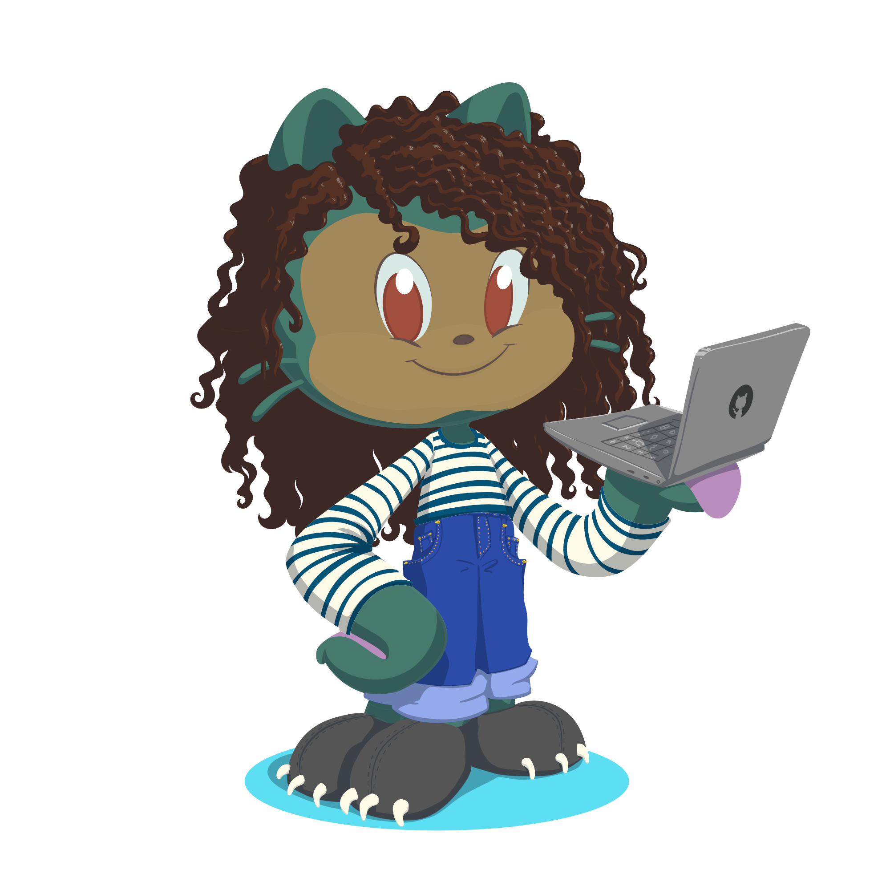

    
    <h1>Hi, this is Muiruri Colette👋</h1>

I am a Data Scientist and Biomedical Engineer. I love research and leverage my data skills in exploring the biomedical and health world.

### 🧰  Here's what I use

#### My Data Stack

&nbsp;
&nbsp;
&nbsp;
&nbsp;
&nbsp;
&nbsp;
&nbsp;
&nbsp;
&nbsp;
&nbsp;

### 📫 How to reach me

&nbsp;

> P.S.  
>| | I'm a big One Piece fan, that could be an icebreaker😉|
>|--|--|

<!--
- I’m  ...
- 👯 I’m looking to collaborate on ...
- 🤔 I’m looking for help with ...
- 💬 Ask me about ...

- 
- ⚡ Fun fact: ...
-->
